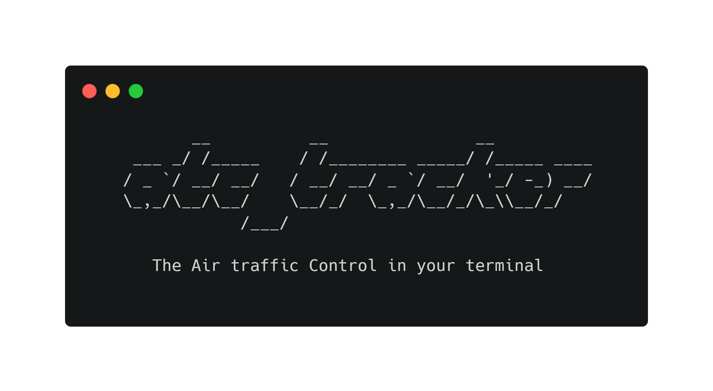
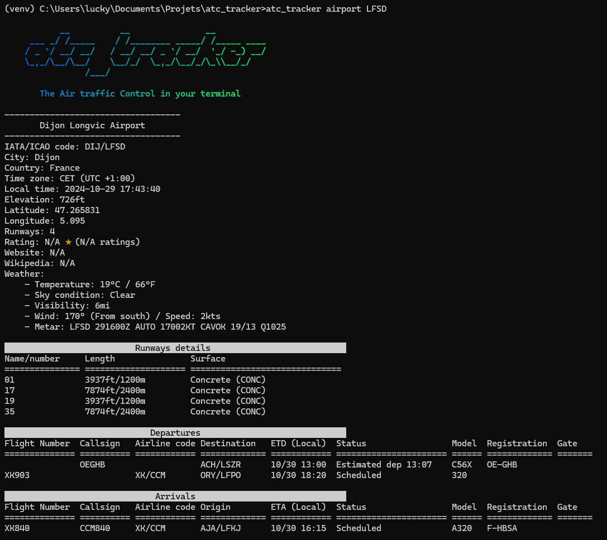
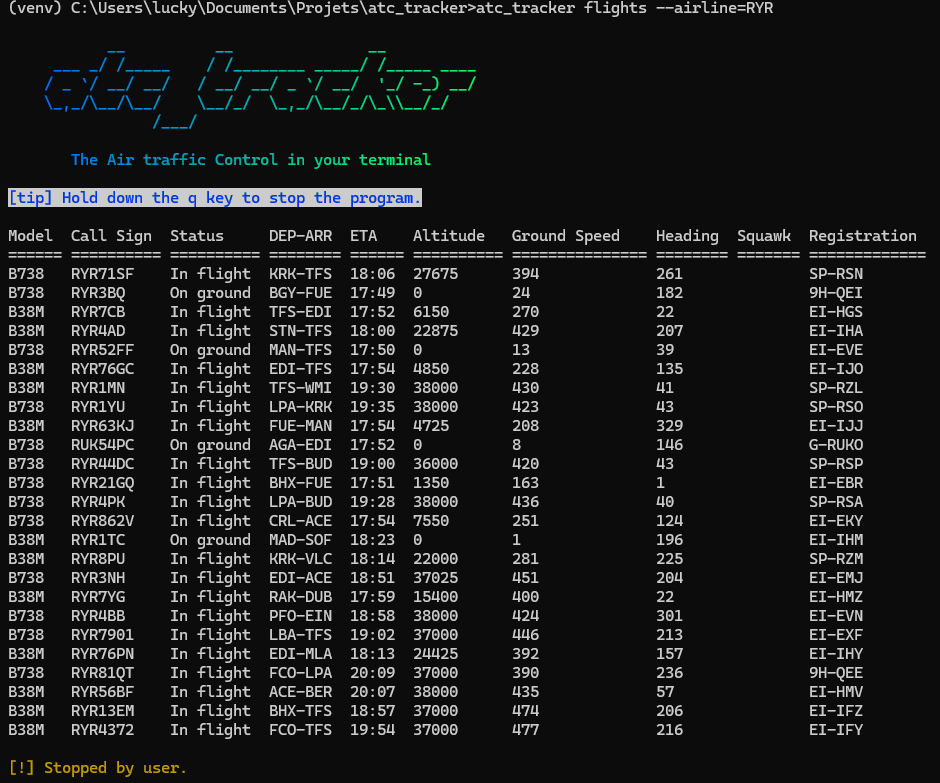

<div align="center">




</div>


## Features
- Display of all current flights
- ETA calculation using precise aircraft and arrival airport coordinates
- Advanced search with combinable filters (Search by airline, model, registration, etc.)
- Real-time flight tracking with full flight details
- Detailed airport information

## Screenshots

<details>
<summary>Airport details</summary>



</details>

<details>
<summary>Flights list (with filters)</summary>



</details>


## Installation

### From PyPi

```
pip install atc_tracker
```

### From source (Github)

```
git clone https://github.com/Luckyluka17/atc_tracker.git
cd atc_tracker/
python setup.py install
```


